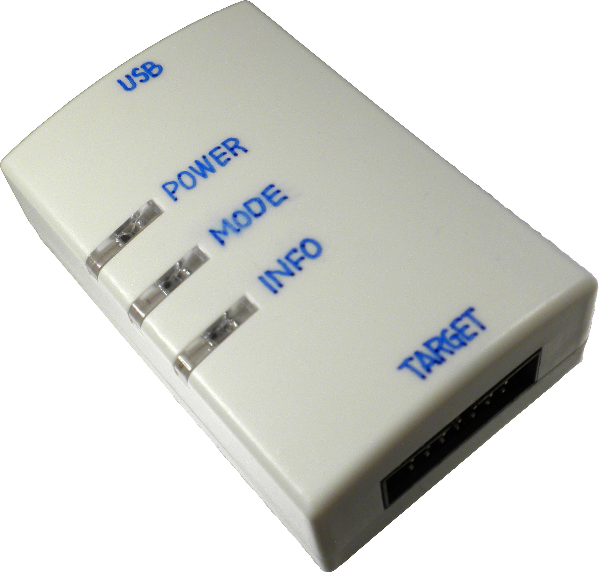

# SigmaLink USBi

The SigmaLink USBi is an all-in-one real-time programming interface.

MAIN COORDINATOR: [Max Chan](https://github.com/xcvista)

The SigmaLink USBi is a low-budget real-time programming device for the freeDSP and other DSP boards from Analog Devices. It is a new PCB design based on a CY7C68013 chip.

It has the same features as the Analog Devices USB interface (EVAL-ADUSB2EBZ), such as changing parameters while already using the freeDSP or easy changes of the schematic in SigmaStudio. You also can write your program to the EEPROM.

Please refer to the documentation for more information.

## License

This work and all other materials under https://github.com/freeDSP are licensed under a [Creative Commons Attribution Share-Alike 4.0 license](LICENSE.md). This allows for both personal and commercial derivative works, as long as they credit freeDSP and release their designs under the same license.

